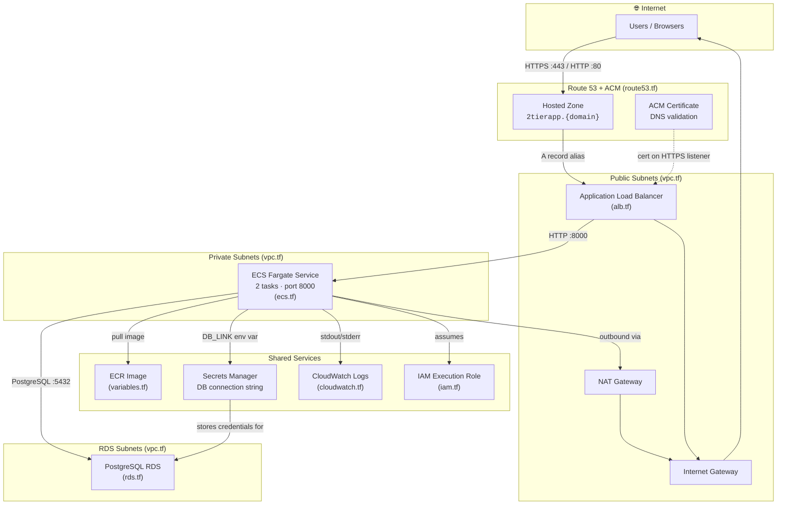
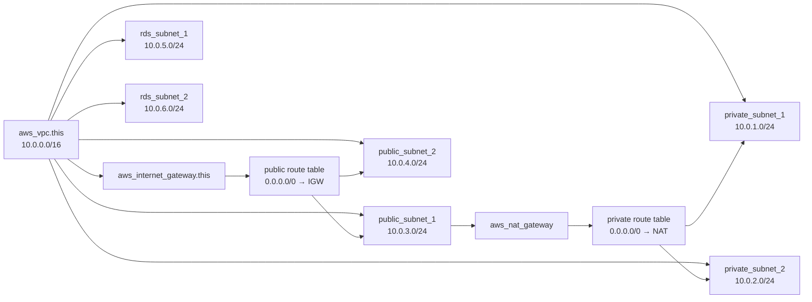
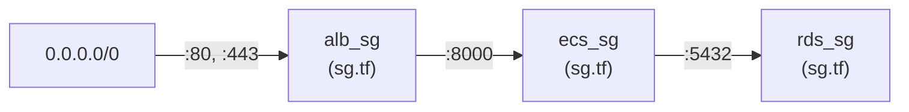
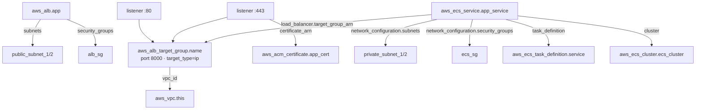
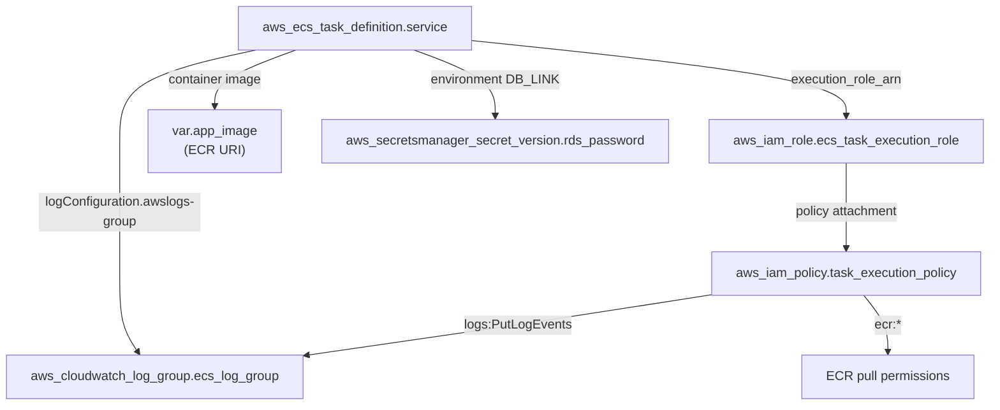
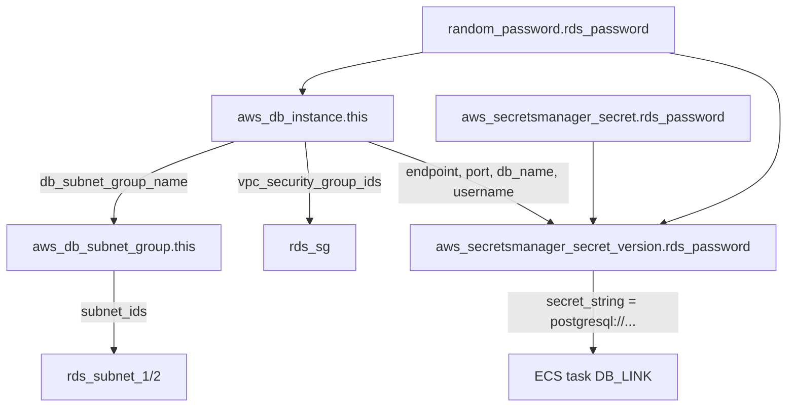
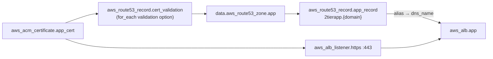
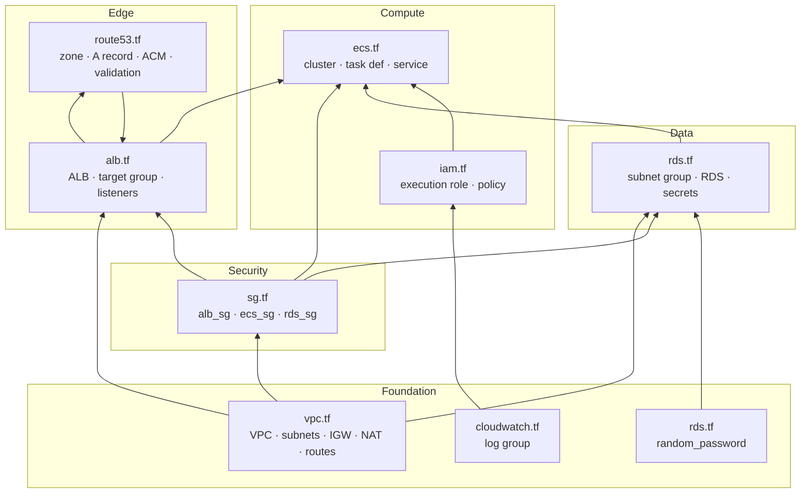
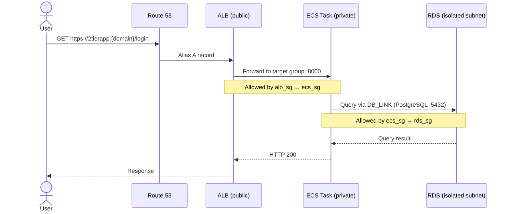

# April 2026 Bootcamp — ECS 2-Tier Infrastructure

Terraform configuration for a production-style **2-tier web application** on AWS: a FastAPI (or similar) app running on **ECS Fargate** behind an **Application Load Balancer**, with a **PostgreSQL RDS** backend.

All resources live in a single flat Terraform root module under `infra/`. There are no nested modules — connections between pieces are expressed through **resource references** (`aws_vpc.this.id`, `aws_security_group.alb_sg.id`, etc.).

---

## High-Level Architecture



---

## Terraform File Map

Each `.tf` file owns a slice of the stack. Resources **wire together** by referencing other resources in the same root module.

| File | Responsibility | Key Resources |
|------|----------------|---------------|
| `versions.tf` | Terraform & provider pins, S3 remote state backend | `terraform { backend "s3" ... }` |
| `provider.tf` | AWS provider config & default tags | `provider "aws"` |
| `variables.tf` | Input variables (region, image, domain, ports) | `var.aws_region`, `var.app_image`, … |
| `vpc.tf` | Network foundation | VPC, IGW, NAT, public/private/RDS subnets, route tables |
| `sg.tf` | Layered security groups | `alb_sg` → `ecs_sg` → `rds_sg` |
| `alb.tf` | Public-facing load balancer | ALB, target group, HTTP/HTTPS listeners |
| `route53.tf` | DNS & TLS | Route 53 A record, ACM cert, validation records |
| `ecs.tf` | Compute layer | ECS cluster, task definition, Fargate service |
| `rds.tf` | Data layer | RDS instance, subnet group, Secrets Manager secret |
| `iam.tf` | Task permissions | ECS execution role + ECR/CloudWatch policy |
| `cloudwatch.tf` | Observability | ECS log group |
| `ecr.tf` | Placeholder | Image URI is supplied via `var.app_image` |
| `output.tf` | Outputs (currently commented out) | — |

---

## How Terraform Pieces Connect

### 1. Network Layer — everything anchors to the VPC



**Who uses which subnets:**

| Subnet type | CIDR blocks | Consumed by |
|-------------|-------------|-------------|
| Public | `10.0.3.0/24`, `10.0.4.0/24` | ALB, NAT Gateway |
| Private | `10.0.1.0/24`, `10.0.2.0/24` | ECS Fargate tasks |
| RDS | `10.0.5.0/24`, `10.0.6.0/24` | RDS subnet group |

---

### 2. Security Groups — layered trust chain

Security groups reference each other instead of open CIDR rules, creating a **north-to-south trust chain**:



| Security Group | Attached to | Inbound | Source |
|----------------|-------------|---------|--------|
| `aws_security_group.alb_sg` | ALB | 80, 443 | Internet (`0.0.0.0/0`) |
| `aws_security_group.ecs_sg` | ECS tasks | 8000 | `alb_sg` |
| `aws_security_group.rds_sg` | RDS | 5432 | `ecs_sg` |

All three security groups set `vpc_id = aws_vpc.this.id`.

---

### 3. Load Balancer → ECS — service registration



The target group uses `target_type = "ip"` because Fargate tasks register by **task ENI IP**, not EC2 instance ID.

---

### 4. ECS Task — image, secrets, logs, IAM



The task definition injects the full PostgreSQL connection string as the `DB_LINK` environment variable, sourced from Secrets Manager.

---

### 5. RDS + Secrets Manager — data layer



---

### 6. DNS & TLS — public hostname to ALB



---

## Full Dependency Graph (Terraform apply order)

Terraform resolves this graph automatically. Arrows show **"depends on"** direction:



---

## Request & Data Flow

End-to-end path when a user hits the app:



**Outbound from ECS tasks** (e.g. pulling ECR images, writing logs) routes through the **NAT Gateway** in the public subnet, then out via the **Internet Gateway**.

---

## Remote State

State is stored remotely in S3 (configured in `versions.tf`):

| Setting | Value |
|---------|-------|
| Bucket | `state-bucket-879381241087` |
| Key | `april26/ecs/terraform.tfstate` |
| Region | `ap-south-1` |
| Locking | S3 native lockfile (`use_lockfile = true`) |
| Encryption | Enabled |

---

## Variables

| Variable | Default | Used by |
|----------|---------|---------|
| `aws_region` | `ap-south-1` | Provider, subnets, logs |
| `ecs_cluster_name` | `april-2tier-ecs-cluster` | ECS cluster |
| `ecs_task_def` | `april-2tier-taskdef` | Task definition, IAM, log group |
| `ecs_service` | `april-2tier-ecs-service` | ECS service |
| `app_image` | ECR URI (`april-ecs-2tier:1.0`) | Container image |
| `container_name` | `2tier` | Task & service load balancer block |
| `port` | `8000` | Target group, container port, health check |
| `domain` | `livingdevops.org` | Route 53 & ACM |

---

## Deploy

```bash
cd infra

# Initialize backend & providers
terraform init

# Preview changes
terraform plan

# Apply infrastructure
terraform apply
```

### Prerequisites

- AWS credentials with permissions for VPC, ECS, RDS, ALB, Route 53, ACM, IAM, Secrets Manager, and CloudWatch
- An existing **Route 53 hosted zone** for `var.domain`
- A container image pushed to **ECR** (or update `var.app_image`)
- S3 bucket `state-bucket-879381241087` accessible for remote state

---

## File Reference Quick Links

```
infra/
├── versions.tf      # Terraform version, providers, S3 backend
├── provider.tf      # AWS provider (ap-south-1)
├── variables.tf     # All input variables
├── vpc.tf           # VPC, subnets, IGW, NAT, routing
├── sg.tf            # Security groups (ALB → ECS → RDS)
├── alb.tf           # Load balancer, target group, listeners
├── route53.tf       # DNS records, ACM certificate
├── ecs.tf           # ECS cluster, task definition, service
├── rds.tf           # PostgreSQL, secrets, random password
├── iam.tf           # ECS task execution role & policy
├── cloudwatch.tf    # ECS log group
├── ecr.tf           # (placeholder — image via variable)
├── output.tf        # Outputs
└── readme.md        # This file
```

---

## Architecture Summary

| Layer | AWS Service | Terraform file | Network placement |
|-------|-------------|----------------|-------------------|
| DNS / TLS | Route 53, ACM | `route53.tf` | Global / regional |
| Edge | Application Load Balancer | `alb.tf` | Public subnets |
| Compute | ECS Fargate | `ecs.tf` | Private subnets |
| Data | RDS PostgreSQL | `rds.tf` | RDS subnets (no public access) |
| Secrets | Secrets Manager | `rds.tf` | Regional |
| Identity | IAM | `iam.tf` | Regional |
| Observability | CloudWatch Logs | `cloudwatch.tf` | Regional |
| Network | VPC, IGW, NAT | `vpc.tf` | `ap-south-1` |
| Firewall | Security Groups | `sg.tf` | VPC-scoped |

The design follows a classic **2-tier pattern**: the presentation/compute tier (ECS) and the data tier (RDS) are isolated in separate subnets, with traffic entering only through the ALB and database access restricted to ECS tasks via security group references.
